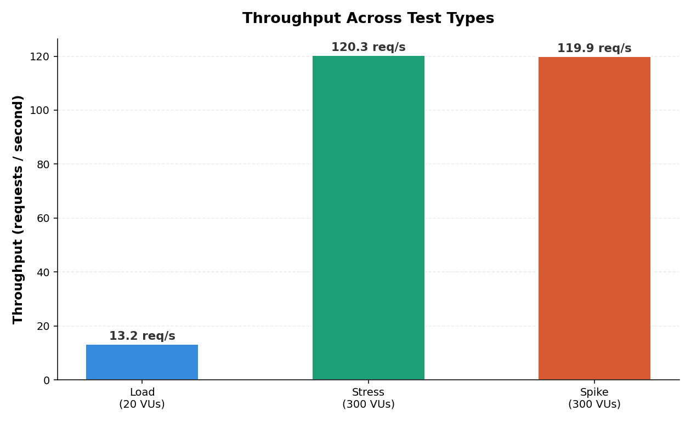
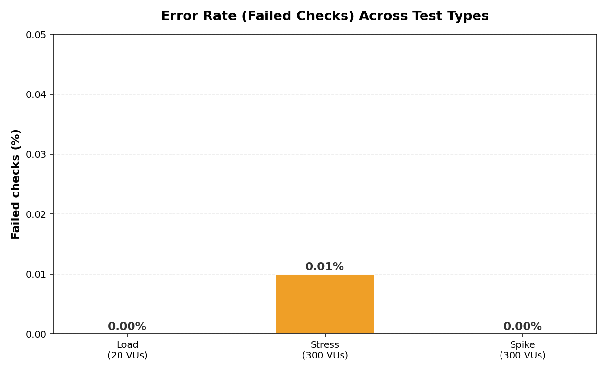

# Performance Testing and Bottleneck Analysis of the JSONPlaceholder API Using Grafana k6

### 🎯 ITT440 Individual Assignment

| 🛠️ Tool | 💻 Language | 🧪 Tests | ✅ Status |
|:-------:|:-----------:|:--------:|:---------:|
| **Grafana k6** | **JavaScript** | Load · Stress · Spike | **All Passed** |

| 📋 Detail | ℹ️ Information |
|:---------:|:-------------:|
| 👤 **Student** | Mariatulkaftiah binti Othman |
| 🎯 **Target API** | `jsonplaceholder.typicode.com/posts` |
| 🛠️ **Primary Tool** | Grafana k6 (JavaScript) |
| 🧪 **Tests** | Load · Stress · Spike |

---

## 📊 Results at a Glance

| Test | What it checks | p95 | Throughput | Errors | Result |
|:----:|:--------------:|:---:|:----------:|:------:|:------:|
| 🟢 **Load** | Normal (20 users) | `264 ms` | `13 req/s` | `0%` | ✅ Pass |
| 🟠 **Stress** | Heavy (300 users) | `171 ms` | `120 req/s` | `0%` | ✅ Pass |
| 🔴 **Spike** | Sudden burst | `483 ms` | `120 req/s` | `0%` | ✅ Pass |

### 💡 Main Findings
- The API was very strong
- It handled 300 users with **zero failures**
- The only weakness was **tail latency**
- A few requests reached 5 seconds, while most stayed under half a second

---

## 📑 Table of Contents
1. ⚙️ [How It Works](#️-how-it-works)
2. ❓ [Problem Statement](#-problem-statement)
3. 💻 [Minimum Requirements](#-minimum-requirements)
4. 📥 [Installation & How to Run](#-installation--how-to-run)
5. 🧪 [Test Types](#-test-types)
6. 📐 [Metrics Explained](#-metrics-explained)
7. 📜 [Test Scripts](#-test-scripts)
8. 📈 [Results & Analysis](#-results--analysis)
9. 🔍 [Bottlenecks & Recommendations](#-bottlenecks--recommendations)
10. ✅ [Conclusion](#-conclusion)
11. 🎥 [Demo Video](#-demo-video)
12. 📚 [References](#-references)

---

## ⚙️ How It Works

```
Maelicious88's PC  ----- sends requests ----->  JSONPlaceholder API
   (runs k6)                                    (the server)
Maelicious88's PC  <---- gets responses ------  returns JSON data
```

My PC runs k6 and acts like many users. JSONPlaceholder is the server that answers. In short:
- **My PC** sends HTTP requests using k6
- **The API** returns JSON responses
- **k6** measures response time, throughput, and errors
- Speed varies a little each run because requests travel over the internet

---

## ❓ Problem Statement

APIs must handle different traffic patterns, from steady use to sudden spikes. This project tests the JSONPlaceholder `/posts` endpoint under three patterns to find where it slows down:

| Test | Purpose |
|------|---------|
| **Load** | Check normal traffic (20 users) |
| **Stress** | Find the breaking point (up to 300 users) |
| **Spike** | Test a sudden burst (10 to 300 users) |

### Why I Chose Grafana k6
- Tests are written in JavaScript, easy to read and save on GitHub
- Can simulate hundreds of users on a normal laptop
- Gives clear results: response time, percentiles, throughput, error rate
- Free, open source, and used by real companies

**My hypothesis before testing:**
- Normal load would be fast with no errors
- Heavy stress would slow the API and cause errors past a certain point
- A sudden spike would cause a temporary slowdown, then recover

---

## 💻 Minimum Requirements

You do not need a powerful computer to run this project. Any normal laptop works. Here is what you need:

| Requirement | Minimum | Why it is needed |
|:-----------:|:-------:|:-----------------|
| 🛠️ **Grafana k6** | v2.0.0 or newer | The testing tool that sends traffic and measures results |
| 🧠 **RAM** | 512 MB | k6 is very light, even an old laptop can run it |
| 🖥️ **Operating System** | Windows 10 / macOS 12 / Ubuntu 20.04 (or newer) | k6 works on all three (I used Windows 11) |
| 🌐 **Internet** | Required | The tests send real requests to the live API online |

---

## 📥 Installation & How to Run

**Step 1, install k6 on Windows:**
```bash
winget install k6 --source winget
```

**Step 2, check it works:**
```bash
k6 version
```

**Step 3, run the three tests:**
```bash
k6 run load-test.js
k6 run stress-test.js
k6 run spike-test.js
```

**Files in this folder:**
```
README.md            (this article)
load-test.js         (load test script)
stress-test.js       (stress test script)
spike-test.js        (spike test script)
response-time-comparison.png
throughput.png
error-rate.png
```

---

## 🧪 Test Types

### 🟢 Load Test (20 users)
Ramps to 20 users, holds 1 minute, ramps down. Copies normal daily traffic. Threshold: 95% of requests under 500 ms.

### 🟠 Stress Test (up to 300 users)
Climbs in steps (50, 100, 200, 300) to find the breaking point. Threshold: 95% under 2000 ms.

### 🔴 Spike Test (sudden burst)
Jumps from 10 to 300 users in 10 seconds, like a viral post. Threshold: 95% under 3000 ms.

---

## 📐 Metrics Explained

| Metric | Meaning |
|--------|---------|
| **Average** | Mean time of all requests. Can hide slow ones. |
| **p95** | 95% of requests were faster than this. The most useful number. |
| **Max** | The single slowest request (worst case). |
| **Throughput** | Requests answered per second. Higher is better. |
| **Error rate** | Percentage of failed requests. |
| **VUs** | Virtual users (fake users k6 pretends to be). |

### ⭐ Why p95 matters
- If 100 people use the API and p95 is 264 ms, then 95 of them got an answer faster than 264 ms
- Only the 5 slowest people waited longer
- I use p95 instead of the average, because the average can hide a few very slow requests
- Those hidden slow requests give some users a bad experience, so p95 shows the real picture

---

## 📜 Test Scripts

The scripts are JavaScript files. You make each one in a text editor, save it with the `.js` ending, and run it with `k6 run`. They are also in this repository to download.

### Load Test
```javascript
export const options = {
  stages: [
    { duration: '30s', target: 20 },  // ramp up
    { duration: '1m',  target: 20 },  // hold
    { duration: '30s', target: 0  },  // ramp down
  ],
  thresholds: {
    http_req_duration: ['p(95)<500'],
    http_req_failed:   ['rate<0.01'],
  },
};
```

### Stress Test
```javascript
export const options = {
  stages: [
    { duration: '1m', target: 50  },
    { duration: '1m', target: 100 },
    { duration: '1m', target: 200 },
    { duration: '1m', target: 300 },  // breaking point
    { duration: '1m', target: 0   },
  ],
};
```

### Spike Test
```javascript
export const options = {
  stages: [
    { duration: '30s', target: 10  },  // baseline
    { duration: '10s', target: 300 },  // sudden spike
    { duration: '1m',  target: 300 },  // hold
    { duration: '10s', target: 10  },  // drop
    { duration: '30s', target: 10  },  // recover
  ],
};
```

---

## 📈 Results & Analysis

> Tests run on Windows 11 using k6 v2.0.0.

| Test | Avg (ms) | p95 (ms) | Max | Throughput | Errors | Requests |
|:----:|:--------:|:--------:|:---:|:----------:|:------:|:--------:|
| 🟢 Load   | `143` | `264` | `727 ms` | `13.22`  | `0%` | `1,610`  |
| 🟠 Stress | `80`  | `171` | `5.03 s` | `120.35` | `0%` | `36,159` |
| 🔴 Spike  | `206` | `483` | `3.15 s` | `119.91` | `0%` | `18,003` |

### 📋 What Each Test Showed

**🟢 Load Test:**
- p95 of 264 ms (95% of requests faster than this)
- 0% errors
- Under normal traffic, the API is fast and reliable

**🟠 Stress Test:**
- p95 of only 171 ms, even faster than the load test
- The API scales very well, no slowdown with more users
- But the max hit 5 seconds, so a few requests were very slow
- This is the key finding of the project

**🔴 Spike Test:**
- p95 rose to 483 ms during the sudden burst
- Higher than stress, because a burst gives no time to prepare
- 100% of checks passed with 0 errors
- The API survived the surge

### 📊 Chart 1: Response Time


- Average and p95 stayed low in all tests
- But the max bar is much taller (up to 5 s in the stress test)
- Most requests were fast, but a few were very slow
- These slow requests are called **tail latency**, the main weakness

### 📊 Chart 2: Throughput


- Throughput scaled from 13 up to 120 requests per second
- That is about 9 times more traffic, with no crashing
- The API has strong capacity
- It did not reach its limit even at 300 users

### 📊 Chart 3: Error Rate


- The error rate was almost zero everywhere
- The real HTTP error rate was 0% in all tests
- The server never rejected a single request
- Every one of the 55,000+ requests was answered successfully

### 🤔 Did My Hypothesis Hold?
- Normal load is fast and clean: **correct** (p95 264 ms, 0% errors)
- Errors appear under heavy load: **wrong**, in a good way (the API handled 300 users with zero failures, so it is stronger than I thought)
- Spike causes a temporary slowdown but survives: **correct**

---

## 🔍 Bottlenecks & Recommendations

**Bottlenecks:**
1. **Tail latency** is the main weakness, a few requests reached 5 seconds while most were fast.
2. **No breaking point reached**, the API never failed even at 300 users, so its true limit is higher.
3. **Spikes cost more than gradual load**, the spike p95 (483 ms) was higher than the stress p95 (171 ms).

**Recommendations:**
1. Use **caching or a CDN** to reduce tail latency.
2. **Warm up connections** before peak traffic.
3. Add **rate limiting** to handle sudden spikes.
4. Run these tests in a **CI/CD pipeline** to catch problems early.
5. Test **beyond 300 users** next time to find the real limit.

---

## ✅ Conclusion

- The API was stronger than expected, handling 300 users with zero failures across 55,000+ requests
- The only weakness was tail latency, a few slow requests hidden behind a healthy average
- Biggest lesson: you cannot judge performance by the average alone
- The average looked fine in every test, but the p95 and max revealed the real weak point
- This is why percentiles matter in performance testing
- This project taught me how to use a real testing tool and analyse results properly

---

## 🎥 Demo Video

▶️ [Watch on YouTube](https://youtu.be/-rqoxLLtM0s)

The video shows me installing k6, running the three tests, and explaining the results.

---

## 📚 References

| Source | Link |
|--------|------|
| Grafana k6 (official site) | https://k6.io |
| k6 Documentation | https://grafana.com/docs/k6/latest/ |
| k6 on GitHub | https://github.com/grafana/k6 |
| JSONPlaceholder API | https://jsonplaceholder.typicode.com |

Tool installed via the official `GrafanaLabs.k6` winget package.

---

*ITT440, Universiti Teknologi MARA (UiTM), 2026*
