# Performance Testing and Bottleneck Analysis of a REST API Using Apache JMeter

---

## 📄 ITT440: Individual Assignment Report

| Details | Information |
|--------|------------|
| Course | ITT440 - Network Programming |
| Group | NBCS2555A |
| Name | Muhammad Syazwan Bin Azmi |
| Student ID | 2024720249 |
| Lecturer | Sir Shahadan Bin Saad |

---

## 📌 Target API
https://jsonplaceholder.typicode.com/posts

---

## 🛠 Tool Used
Apache JMeter

---

## 🔄 How It Works

JMeter (client) sends HTTP GET requests to the API server.

JMeter ─────────► jsonplaceholder.typicode.com  
(send request)

JMeter ◄───────── jsonplaceholder.typicode.com  
(receive response)

JMeter records:
- Response time  
- Throughput  
- Error rate  

The results may vary depending on network latency, server load, and request patterns.

---

## 🧪 Test Types

### ✅ Load Test
Simulates normal user traffic to evaluate system performance under expected conditions.

### ✅ Stress Test
Pushes the system beyond its capacity to identify breaking points and performance degradation.

### ✅ Soak Test
Tests system stability over a long period of sustained usage.

---

## 📖 Introduction
Performance testing evaluates how a system behaves under different loads. This study focuses on analyzing the performance of a REST API using Apache JMeter.

---

## ❗ Problem Statement

Modern APIs must handle varying user loads efficiently. This project evaluates how a REST API performs under normal, high, and prolonged load conditions to identify performance limitations and bottlenecks.

---

## ⚙️ Test Setup

- Tool: Apache JMeter  
- Protocol: HTTPS  
- Method: GET  

### 📸 HTTP Request Configuration
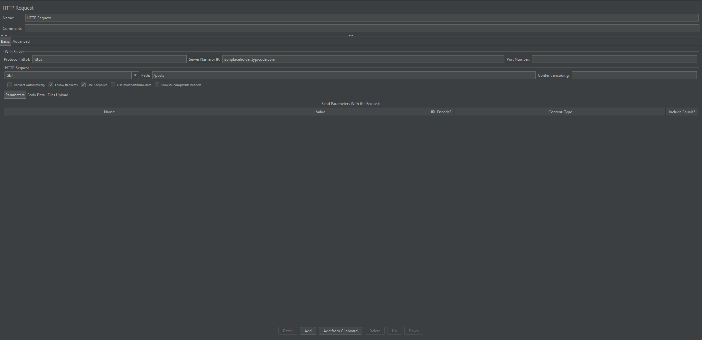

---

## 🔍 Load Test

### ✅ Configuration
- Users: 10  
- Ramp-Up: 10 seconds  
- Loop Count: 10  

### 📊 Results
- Total Requests: 16,750  
- Average Response Time: 189 ms  
- Throughput: 1.8 requests/sec  
- Error Rate: **5.98%**

---

### 📸 Screenshots
#### Thread Group
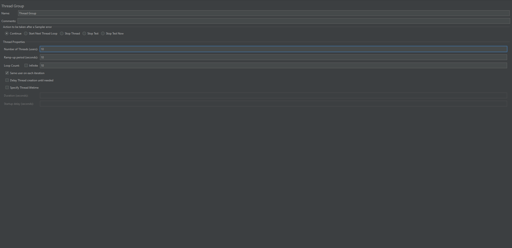

#### Aggregate Report

#### Graph Results
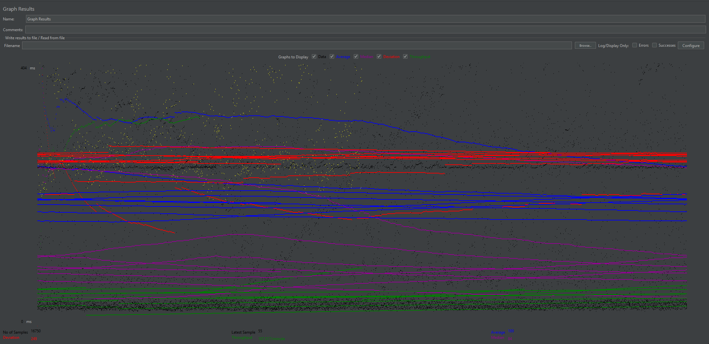

---

### 🧠 Analysis

The system performs efficiently under normal load, maintaining low response time and a small error rate. This indicates that the API is stable and responsive under expected user traffic.

---

### ✅ Conclusion

The system handles normal usage effectively with minimal performance issues.

---

## 🔥 Stress Test (Gradual Load)

### ✅ Configuration
- Users: 200  
- Ramp-Up: 10 seconds  
- Loop Count: 10  

### 📊 Results
- Total Requests: 18,750  
- Average Response Time: 175 ms  
- Throughput: 2.0 requests/sec  
- Error Rate: **5.34%**

---

### 📸 Screenshots
#### Thread Group
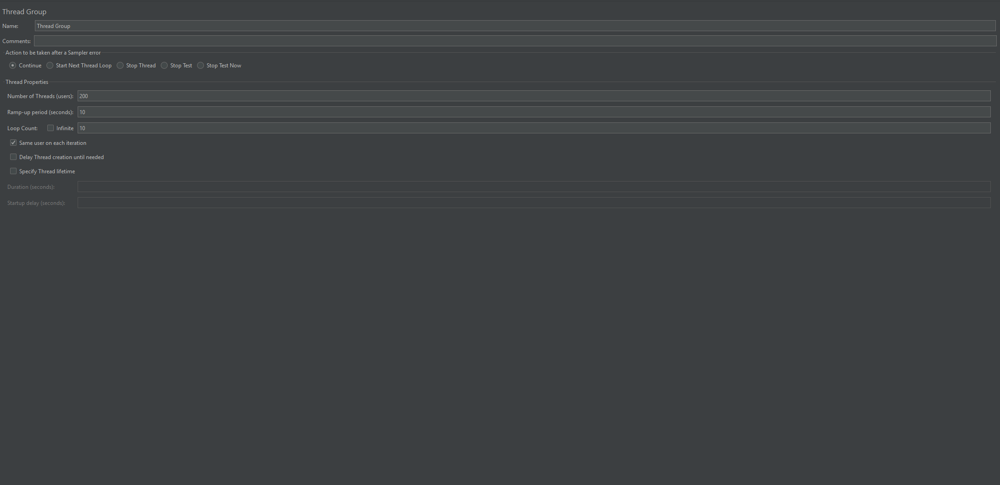

#### Aggregate Report
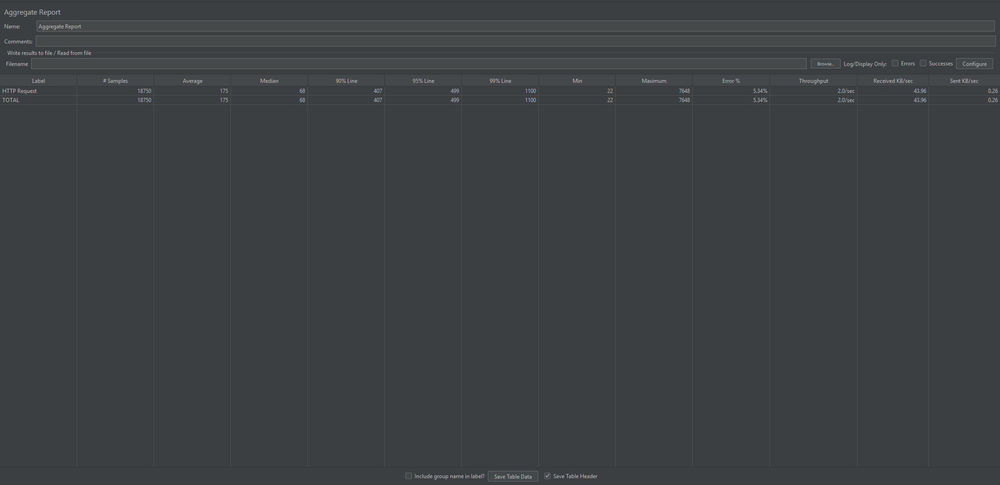

#### Graph Results
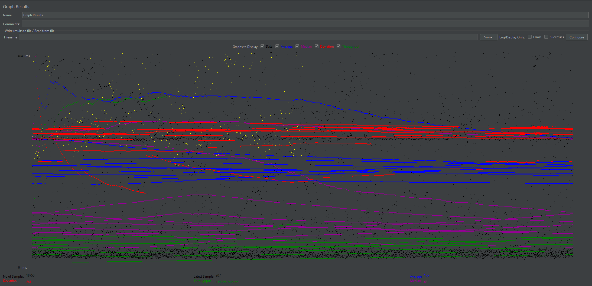

---

### 🧠 Analysis

Despite a large increase in users, the system maintained stable performance. Response time improved slightly, and error rate decreased.

This indicates that the API can scale efficiently when load is applied gradually.

---

### ✅ Conclusion

The system handles high user load effectively when traffic is distributed over time.

---

## ⚡ Stress Test (Burst Condition)

### ✅ Configuration
- Users: 200  
- Ramp-Up: 1 second  
- Loop Count: 10  

### 📊 Results
- Total Requests: 20,750  
- Average Response Time: 206 ms  
- Throughput: 2.2 requests/sec  
- Error Rate: **4.82%**

---

### 📸 Screenshots
#### Thread Group

#### Aggregate Report
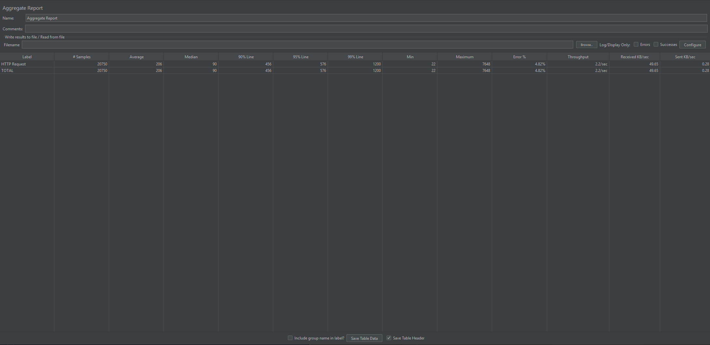

#### Graph Results
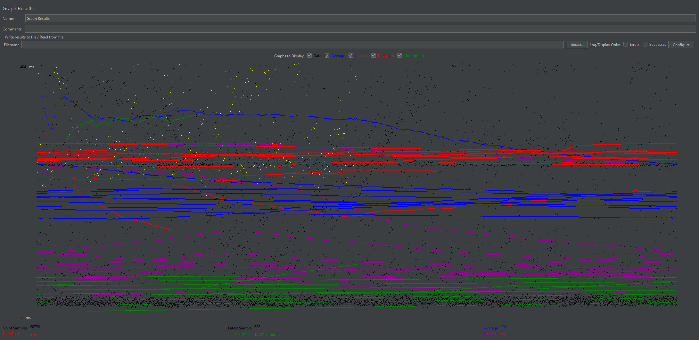

---

### 🧠 Analysis

When traffic was applied suddenly, response time increased and performance became less consistent. Although the error rate remained relatively low, the system showed reduced efficiency under burst conditions.

This indicates that performance degradation occurs due to sudden spikes rather than sustained load.

---

### ⚠️ Identified Bottleneck

✅ System is sensitive to **burst traffic (sudden request spikes)**

---

### ✅ Conclusion

The system struggles more with sudden traffic spikes than with high user volume.

---

## ⏳ Soak Test

### ✅ Configuration
- Users: 10  
- Ramp-Up: 10 seconds  
- Duration: 600 seconds  

### 📊 Results
- Total Requests: 163,475  
- Average Response Time: 62 ms  
- Throughput: 16 requests/sec  
- Error Rate: **0.61%**

---

### 📸 Screenshots
#### Thread Group
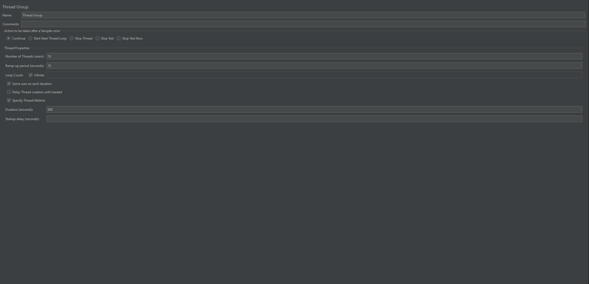

#### Aggregate Report
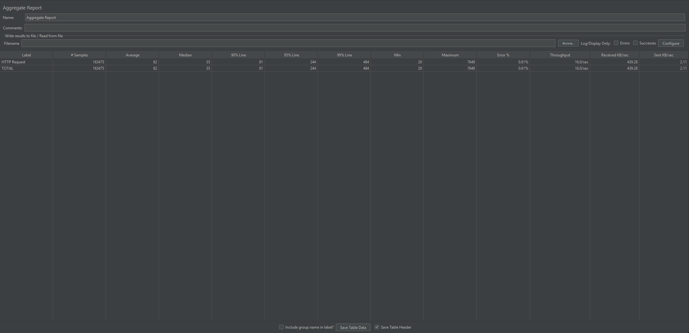

#### Graph Results
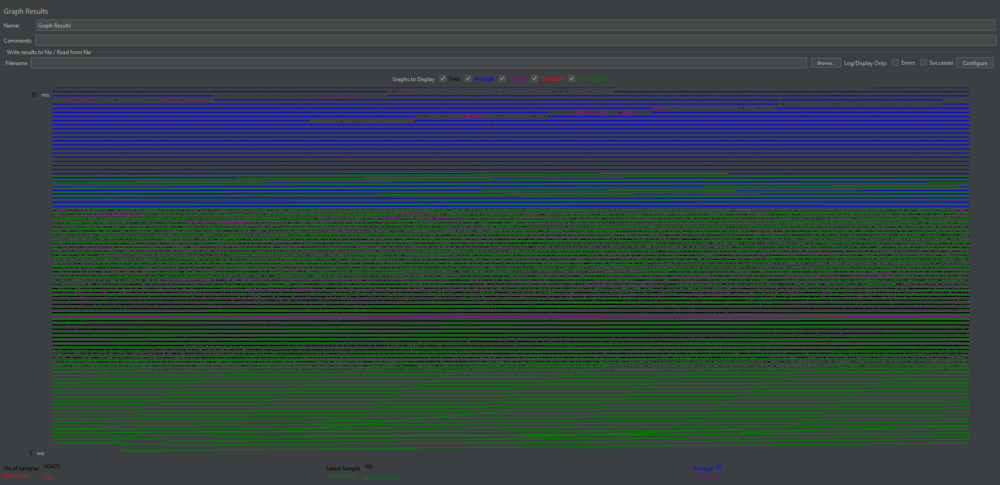

---

### 🧠 Analysis

The system maintained excellent performance over a long duration. Response time remained low, and error rate was minimal, showing strong stability.

---

### ✅ Conclusion

The system performs reliably over extended periods without degradation.

---

## 📊 Results Summary

| Test | Users | Response Time | Throughput | Error Rate |
|------|------|--------------|------------|-----------|
| Load | 10 | 189 ms | 1.8/sec | 5.98% |
| Stress (Gradual) | 200 | 175 ms | 2.0/sec | 5.34% |
| Stress (Burst) | 200 | 206 ms | 2.2/sec | 4.82% |
| Soak | 10 | 62 ms | 16/sec | 0.61% |

---

## 🧠 Overall Analysis

System performance depends heavily on traffic patterns rather than the number of users alone. This demonstrates that effective system design must consider both scalability and traffic control mechanisms to handle real-world usage patterns.

The API performs well under normal load, high user load (when gradual), and long-duration usage. However, performance efficiency decreases under sudden traffic spikes, indicating that burst traffic is the primary bottleneck.

---
